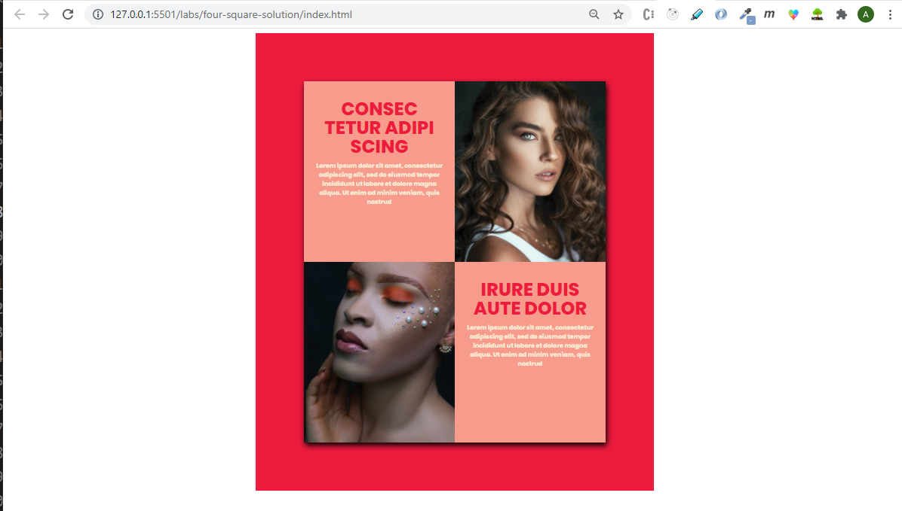

# Super-hero CSS

For this lab you're going to modify the starter code to style the content with CSS styles to look like the final screen captures below.

* The colors are supplied in the styles.css file.
* The text is in the index.html file.
  
There are several CSS styles that are at play in this lab.
* [background image](https://chnn-anne.gitbook.io/html-css/advanced-css-lectures/background-image)
* [box-shadow](https://chnn-anne.gitbook.io/html-css/advanced-css-lectures/box-shadow)
* [centering content](https://chnn-anne.gitbook.io/html-css/advanced-css/centering-elements)

